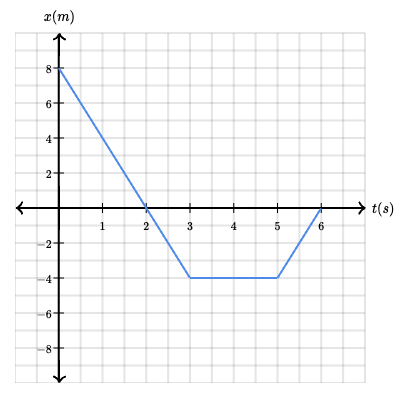
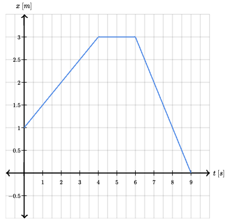
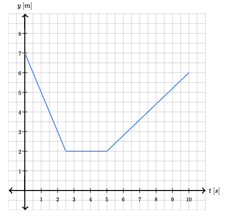

## Exercise 1: Disoriented iguana

An iguana with a poor sense of spatial awareness is walking back and forth in the desert. First the iguana walks 12 meters to the right in a time of 20 seconds. Then the iguana runs 16 meters to the left in a time of 8 seconds.

What was the average speed and average velocity of the iguana for the entire trip? (Rightward is the positive direction)

**Distance travaled (Range)**

$r = 12m + 16m = 28\text{ m}$

**Time interval**

$t = 20s + 8s = 28\text{ s}$

_**Average speed**_

$V_{avg} = \frac{r}{t} = \frac{28m}{28s} = 1\text{ m/s}$

**Displacement**

$\vec{s} = 12m - 16m = -4m$ (12m are to the right [positive] and 16m are to the left [negative])

_**Average velocity**_

$v_{avg} = \frac{\vec{s}}{t} = \frac{-4m}{28s} = -\frac{1}{7}\text{ m/s}$

## Exercise 2: Hungry dolphin

A hungry dolphin is swimming horizontally back and forth looking for food. The motion of the dolphin is given by the position graph shown below.

Determine the following for the dolphin:

1. average velocity between time $t = 0\text{ s}$ to $t = 6\text{ s}$
2. average speed between $t = 0\text{ s}$ to $t = 6\text{ s}$
3. instantaneous velocity at time $t = 1\text{ s}$
4. instantaneous speed at time $t = 4\text{ s}$

**1. Average velocity**

$t = 6\text{ s}$

$\vec{s} = 0 - 8 = 8\text{ m}$ ($t = 0\text{ s}$ to $t = 6\text{ s}$)

$v_{avg} = \frac{\vec{s}}{t} = \frac{-8m}{6s} = -\frac{4}{3}\frac{m}{s}$

**2. Average speed**

$t = 6\text{ s}$

$d = 12 + 4 = 16\text{ m}$ ($t = 0\text{ s}$ to $t = 6\text{ s}$)

$V_{avg} = \frac{d}{t} = \frac{16}{6} = \frac{8}{3}\frac{m}{s}$

**3. Intsantaneous velocity**

$t = 1\text{ s}$

$v_{instantaneous} = \frac{x_2 - x_0}{t_2 - t_0} = \frac{0 - 8}{2 - 0} = -4\frac{m}{s}$

**4. Intsantaneous speed**

$t = 4\text{ s}$

$V_{instantaneous} = 0\frac{m}{s}$

The instantaneous speed is 0, because the x or traveled distance is not changing, as we can see in graph.

## Exercise 3: Hungry walrus

The motion of a hungry walrus walking back and forth horizontally looking for food is given by the graph below, which shows the horizontal position $x$ as a function of time $t$.

What was the instantaneous velocity of the walrus at the following times: $2\text{ s}$, $5\text{ s}$, and $8\text{ s}$?

$v_{instantaneous}(t = 2) = \frac{3 - 1}{4 - 0} = \frac{1}{2}\frac{m}{s}$

$v_{instantaneous}(t = 5) = \frac{3 - 3}{6 - 4} = 0\frac{m}{s}$

$v_{instantaneous}(t = 8) = \frac{0 - 3}{9 - 6} = -1\frac{m}{s}$

## Exercise 4: Happy bird

The motion of an extraordinarily jubilant bird flying straight up and down is given by the graph below, which shows the vertical position $y$ as a function of time $t$. Answer the following questions about the motion of the bird.

- What was the average velocity of the bird between $t=0\text{ s}$ and $t=10\text{ s}$?
- What was the average speed of the bird between $t=0\text{ s}$ and $t=10\text{ s}$?

**Average velocity**

$v_{avg} = \frac{\Delta x}{\Delta t} = \frac{displacement}{\text{time interval}} = \frac{6 - 7}{10} = -\frac{1}{10}\frac{m}{s}$ ($t=0\text{ s}$ and $t=10\text{ s}$)

$V_{avg} = \frac{d}{t} = \frac{distance}{\text{time interval}} = \frac{5 + 0 + 4}{10} = \frac{9}{10}\frac{m}{s}$ ($t=0\text{ s}$ and $t=10\text{ s}$)
