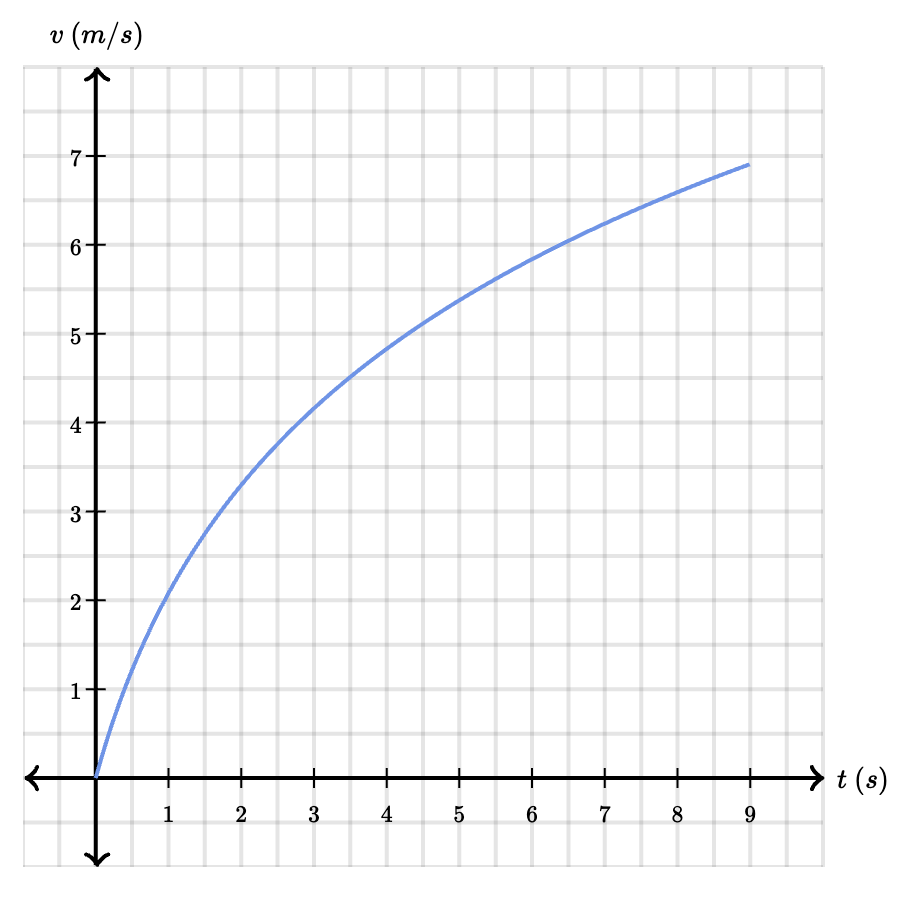
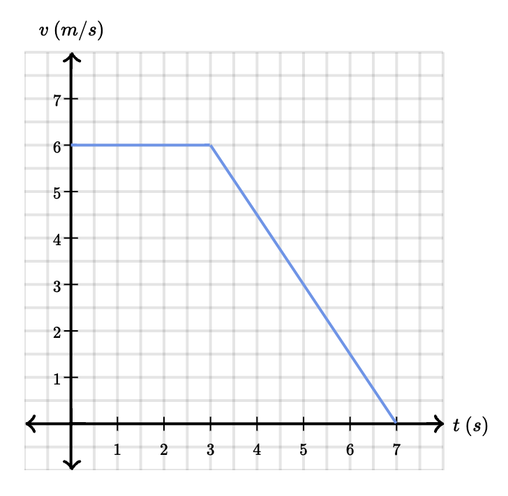
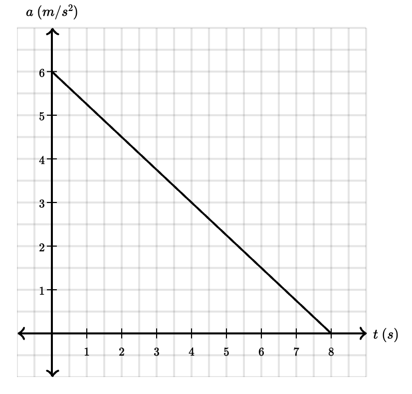
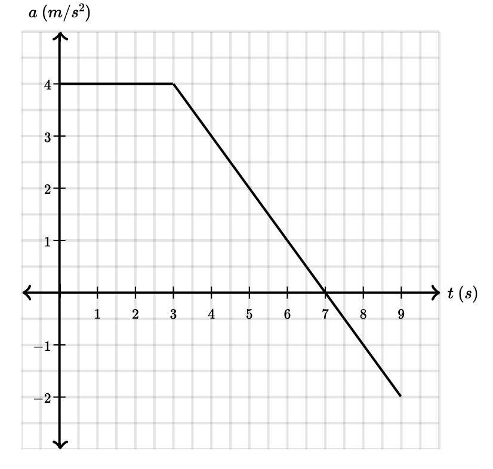

## Example 1:

A neurotic tiger shark starts from rest and speeds up uniformly to 12 meters per second in a time of 3 seconds.

What was the magnitude of the average acceleration of the tiger shark?

$v_f = 12\text{ m}$

$t_f = 3\text{ s}$

$\vec{a} = \frac{\Delta\vec v}{\Delta t} = \frac{12 - 0}{3} = 4\frac{m}{s^2}$

## Example 2:

A bald eagle is flying to the left with a speed of 34 meters per second when a gust of wind blows back against the eagle causing it to slow down with a constant acceleration of a magnitude 8 meters per second squared.

What will the speed of the bald eagle be after the wind has blown for 3 seconds?

$\vec{v_{eagle}} = 34\text{ m/s (to the left)}$

$\vec{a_{wind}} = 8\frac{m}{s^2}\text{(againt the eagle [to the right])}$

$\vec{a} = \frac{\Delta \vec{v}}{\Delta t} \rightarrow \Delta \vec{v} = \vec{a}\Delta t \rightarrow \vec{v_f} - \vec{v_i} = \vec{a}\Delta t \rightarrow \vec{v_f} = \vec{a}\Delta t + \vec{v_i}$

$\vec{v_f} = \vec{a}\Delta t + \vec{v_i} = 8 * 3 + (-34) = -10\frac{m}{s} \text{(After 3 seconds)}$

Since we want speed of the bald eagle, speed will be always positive since it is scalar. **Answer is +10 m/s**

## Example 3: Windsurfing speed change

A windsurfer is traveling along a straight line, and her motion is given by the velocity graph below.

Select all of the following statements that are true about the speed and acceleration of the windsurfer.

- (A) Speed is increasing.
- (B) Acceleration is increasing.
- (C) Speed is decreasing.
- (D) Acceleration is decreasing.

True statements are **A**, because the velocity after every second is getting greater and greater, and **D**, because after every second the velocity is increasing with a smaller.

False statements are **C and B**

## Example 4: Go-kart acceleration

The motion of a go-kart is shown by the velocity vs. time graph below.

- A. What was the acceleration of the go-kart at time $t=4\text{ s}$?
- B. What was the displacement of the go-kart between $t=0\text{ s}$ and $t=7\text{ s}$?

**Acceleration of the go-kart at time $t=4\text{ s}$**

$\vec{a} = \frac{\Delta \vec{v}}{\Delta t} = \frac{v_f - v_i}{t_f - t_i}$

I calculate the acceleration between $t = 3$ and $t = 7$, because the slope during this time is linear (constantly decreasing)

$\vec{a} = \frac{0 - 6}{7 - 3} = -\frac{3}{2}\frac{m}{s^2}$ (The go-karts acceleration at $t = 4$)

**Displacement of the go-kart between $t=0\text{ s}$ and $t=7\text{ s}$**

$\vec{s} = \Delta v * \Delta t$

$\vec{s}_{t<=3} = 6 * 3 = 18\text{ m}$

$\vec{s}_{t>3} = \frac{|(0 - 6)| * |(7 - 3)|}{2} = \frac{6 * 4}{2} = 12\text{ m}$

$\vec{s}_{total} = \vec{s}_{t<=3} + \vec{s}\_{t>3} = 18 + 12 = 30\text{ m} $

## Example 5: Race car acceleration

A confident race car driver is cruising at a constant velocity of 20 m/s. As she nears the finish line, the race car driver starts to accelerate. The graph shown below gives the acceleration of the race car as it starts to speed up. Assume the race car had a velocity of 20 m/s at time $t=0\text{ s}$.

What is the velocity of the race car after the 8 seconds of acceleration shown in the graph?

$\vec{v_0} = +20\frac{m}{s}$

$t_0 = 0\text{ s}$

**Velocity of the race car after 8 seconds**

$\vec{a} = \frac{\Delta\vec{v}}{\Delta t} \rightarrow \Delta \vec{v} = \vec{a} * \Delta t$

$\Delta \vec{v} = \frac{6 * 8}{2} = \frac{48}{2} = 24\frac{m}{s}$ (after 8 seconds)

$\vec{v}_f = 24 + 20 = 44\frac{m}{s}$

## Example 6: Sailboat windy ride

A sailboat is sailing in a straight line with a velocity of 10 m/s. Then at time $t=0\text{ s}$, a stiff wind blows causing the sailboat to accelerate as seen in the diagram below.

What is the velocity of the sailboat after the wind has blown for 9 seconds?

$\vec{v_0} = +10\frac{m}{s}$

**Velocity of the sailboat after the wind has blown for 9 seconds**

$\vec{a} = \frac{\Delta\vec{v}}{\Delta t} \rightarrow \Delta \vec{v} = \vec{a} * \Delta t$

$\Delta\vec{v}_{t<=3} = 4 * 3 = 12\frac{m}{s}$

$\Delta\vec{v}_{t>3, t<=7} = \frac{|(0 - 4)| * |(7 - 3)|}{2} = \frac{16}{2} = 8\frac{m}{s}$

$\Delta\vec{v}_{t>7} = \frac{(-2 - 0) * (9 - 7)}{2} = -2\frac{m}{s}$

$\vec{v}_f = \vec{v_0} + \Delta\vec{v}_{t<=3} + \Delta\vec{v}_{t>3, t<=7} + \Delta\vec{v}_{t>7}= 10 + 12 + 8 + (-2) = 28\frac{m}{s}$

$\vec{a} = \frac{\Delta v}{\Delta t} \rightarrow v_f = \vec{a}\Delta t + v_0$
